Humanoids 2020 Workshop: Talos: Status & Progress
=================================================

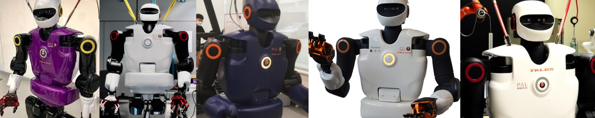

Organizers:
* Alexander Werner, University of Waterloo
* Olivier Stasse, LAAS-CNRS

# Workshop objectives
This workshop aims to facilitate the exchange of information about control approaches for humanoid robots, with the torque controlled robots such as the Talos platform in mind. Starting from a report on the experimentally discovered abilities of the Talos hardware, further needed improvements will be discussed. To put this in context, speakers who work on other humanoid platforms have been invited and will share their perspective. The objective here is to describe and compare viable ways to improve dynamic capabilities of this class of robots. The topic will be addressed in the talks and in the panel discussion.

There are now 6 Talos robots in the world (PAL, LAAS, IJS, Waterloo, INRIA, Edinburgh) and this workshop will initiate further collaboration. Even if you are not working in one of the labs, we are very happy to discuss possible collaborations.

# Agenda
All Times given here are in `GMT+2` or `CET`.

Note: The workshop core time is `13:30-15:45` - see [here](https://humanoids-2020.org/conference-program/index.html). For this workshop this timeslot contains all lightning (5 minute) summary talks to give everybody an overview. The full-lengths talks are distributed throughout the day. Recordings will be provided.

| Time         | Presenter                       | Talk Title                                   |
|--------------|---------------------------------|----------------------------------------------|
|08:00 - 08:30 | [Olivier Stasse](#stasse)       | SLAM and motion generation for Talos torque controlled robot |
|08:30 - 09:00 | [Jemin Hwangbo](#jemin)         | Learning agile and dynamic motor skills for legged robots |
|09:00 - 09:30 | [Adria Roig](#adria)            | Talos software stack upgrades and progress on whole body control |
|09:30 - 10:00 | [Nikolaos Tsagarakis](#nikolaos) | Torque Control Actuation for Humanoid Robotics |
|--------------|---------------------------------|----------------------------------------------|
|10:00 - 10:30 |Coffee break                     |                                              |
|--------------|---------------------------------|----------------------------------------------|
|10:30 - 11:00 | [Jean-Baptiste Mouret and Serena Ivaldi](#jean) | Whole-body teleoperation and online, data-efficient learning of bad configurations |
|11:00 - 11:30 | [Vladimir Ivan](#vladimir)      | Talos use case: Planning jumping motion using direct transcription |
|11:30 - 12:00 | [Steve Tonneau](#steve)         | Interactive multi contact planning algorithms for Talos |
|12:00 - 12:30 | [Tadej Petric](#tadej) | Humanoids and physical human-robot interaction - learning by switching roles |
|--------------|---------------------------------|----------------------------------------------|
|12:00 - 13:30 | Lunch break                 
|--------------|---------------------------------|----------------------------------------------|
|13:30         | Lightning talk #1               | [Olivier Stasse](#stasse)
|13:35         | Lightning talk #2               | [Jemin Hwangbo](#jemin)
|13:40         | Lightning talk #3               | [Adria Roig](#adria)
|13:45         | Q&A / Coffee & Snacks
|
|13:55         | Lightning talk #4               | [Vladimir Ivan](#vladimir)
|14:00         | Lightning talk #5               | [Jean-Baptiste Mouret and Serena Ivaldi](#jean)
|14:05         | Lightning talk #6               | [Tadej Petric](#tadej)
|14:10         | Q&A / Coffee & Snacks |
|
|14:20         | Lightning talk #7               | [Steve Tonneau](#steve)
|14:25         | Lightning talk #8               | [Alexander Werner](#alexander)
|14:30         | Lightning talk #9               | [Nikolaos Tsagarakis](#nikolaos)
|14:40         | Q&A / Coffee & Snacks |
|
|14:50         | Lightning talk #10              | [Daniele Pucci][#daniele) |
|14:55         | Lightning talk #11
|15:00         | Q&A / Coffee & Snacks |
|
|15:15 - 15:45 | Panel discussion | Technical readiness of human-scale Humanoids
|
|16:00 - 16:30 | [Daniele Pucci](#daniele) | iCub recent developments in motor control, human-physical interaction, and aerial humanoid robotics |
|16:30 - 17:00 | [Alexander Werner](#alexander) | Improving joint torque control performance and effects on whole body control |

##  Olivier Stasse (LAAS-CNRS): SLAM and motion generation for Talos torque controlled robot

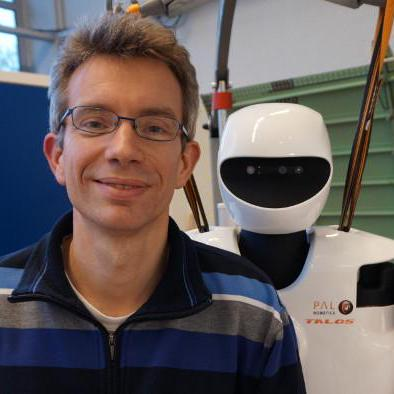
Abstract is coming

##  Steve Tonneau (University of Edinburgh): Motion planning algorithms running on Talos

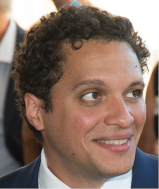
In this talk Steve will present motion planning algorithms that are used for locomotion on the Talos robot. The talk will focus on two specific contributions: first, LEAS, a reinforcement learning framework for automatically planning guide paths for Talos in constrained environments; second, SL1M (pronounced slim), a footstep planner that can be used in a reactive manner in challenging environments.
<video style="width: 100%;" controls preload="metadata">
	<!-- TODO: webm -->
        <source src="Steve_Tonneau.mp4" type='video/mp4' />
</video>

##  Adrià Roig (PAL Robotics): Talos software stack upgrades and progress on whole body control

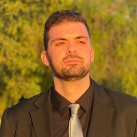
TALOS is a humanoid robot, designed in 2017 by PAL Robotics, that is present in many universities nowadays. This robot has been designed with the objective to perform industrial applications in the Factory of the Futures, as well as to interact in a real human environment. For this purpose, it is equipped with torque sensors in all joints, which enables powerful sensing and multi-contact motions. The closed-loop torque control can be used for whole-body control inverse dynamics and safe interaction with the environment. The motors of this robot can carry out fast movements and handle weights of 6 kg with an outstretched arm. The Ethercat communication allows running ROS control at 2KHz making it the perfect platform for researchers. In this presentation, we will present some of the latest developments of this platform which include WB-MPC and walking in uneven terrain.

<video style="width: 100%;" controls preload="metadata">
	<!-- TODO: webm -->
        <source src="Adria_Roig.mp4" type='video/mp4' />
</video>

##  Vladimir Ivan (University of Edinburgh): Talos use case: Planning jumping motion using direct transcription

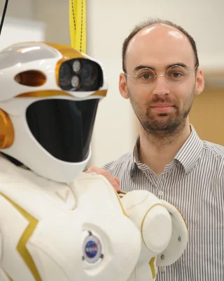
In this session we’ll report on the motion planning work that enabled us to execute jumping motion on the Talos robot. To achieve this, we formulated the problem using direct transcription as a sparse non-linear programming problem. We exploited the rigid body dynamics model of the robot and modelled the dynamic defect constraints using inverse dynamics as opposed to deriving the constraint from forward dynamics equations. The planned trajectories consist of feed forward torque and robot state reference trajectories. We implemented a torque controller that tracks the robot state with PD feedback and inputs the reference torque as a feed forward signal. This enabled us to execute the first jumping motion achieved on the Talos robot.

##  Jean-Baptiste Mouret and Serena Ivaldi (INRIA): Whole-body teleoperation and online, data-efficient learning of bad configurations

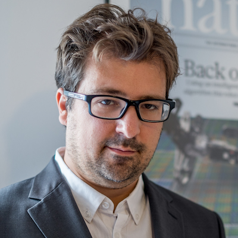
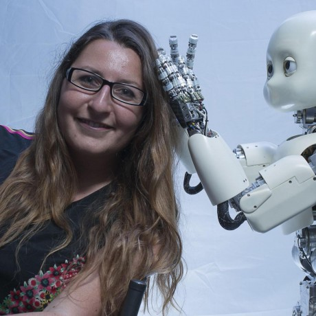
Abstract TBA

##  Tadej Petric (IJS): Humanoids and physical human-robot interaction - learning by switching roles

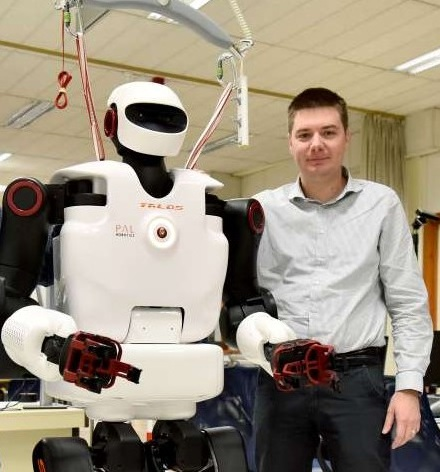
Humanoid robots still have the shortcoming of limited ability to observe and adapt to human dynamics in physical human-robot collaboration. This leads to inefficient collaboration, skill transfer, and learning. In this talk, I will present how skill transfer can be achieved by switching the roles of the assistant agent and the assisted agent. Introducing such a strategy into the concept of learning from demonstrations (LfD) accelerates the learning process by providing a richer set of demonstrations with personalization capabilities. By including human-human, human-robot, and robot-human behaviors, we can gather a wider range of sensory information including force and motion trajectories. As an encoding strategy, we consider a novel holistic approach to encode the behavior of the two agents in a joint model that is used within regression and model predictive control strategies for reaction and anticipation of the agent behaviors.

##   Nikolaos Tsagarakis (IIT): Humanoid Robotics Progress and Challenges @ IIT-HHCM

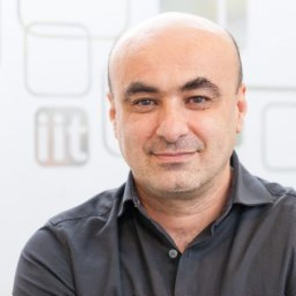
The talk will provide an overview of the humanoids developments within the Humanoid and Human Mechatronics Lab at IIT, introducing the mechatronics and control approaches adopted in the development of a series of humanoid prototypes from the early COMAN to WALK-MAN and more recently to COMAN+ and eventually to CENTAURO semi-humanoid robots. The talk will include highlights on the actuation development of compliant and torque control joints, the overall design principles of the humanoid robots and finally the control tools and implementations and how these were evolved over the years towards the most recent platform in the lab. Current high level challenges will be also discussed. 

##  Daniele Pucchi (IIT): iCub recent developments in motor control, human-physical interaction, and aerial humanoid robotics 

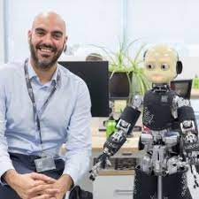
 This talk presents the recent advances of the iCub humanoid robot, the longstanding reference platform developed at the Italian Institute of Technology. In particular, the talk will present the control architectures that enable the iCub to locomote, physical interact with a human being, and also to fly. In this perspective, the design of the iRonCub - the first jet-powered flying humanoid robot - will be presented. 

##  Alexander Werner (University of Waterloo): Improving joint torque control performance and effects on whole body control

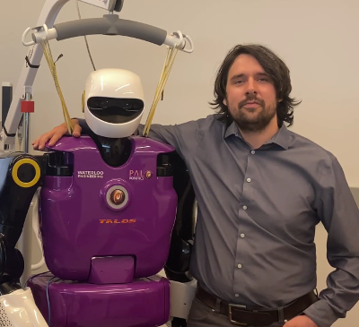
Abstract TBA

##   Jemin Hwangbo (KAIST): TBA

Abstract TBA

